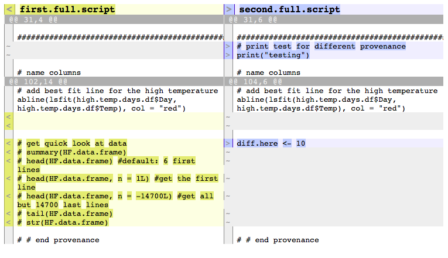

## provExplainR
Reads two provenance directories and generates differences between
two versions including the environment in which the scripts were executed,
versions of attached libraries, versions of provenance tool, name and content
of main and sourced scripts.

provExplainR works with provenance collected by the rdt or rdtLite packages.

## Installation
Installation from GitHub:

```r
# install.packages("devtools")
devtools::install_github("End-to-end-provenance/provExplainR")
```
Once installed, load the package:

```{r}
library("provExplainR")
```

## Usage

1. To view differences between two provenance directories:

```
prov.explain (dir1 = "prov_MyScript", dir2 = "prov_MyScript_2019-08-06T15.59.18EDT")
```

prov.explain function has one optional parameters, <i>save</i>. 
If <i>save</i> is true, the comparison result is saved to a file, in addition to
being displayed in the console. The file is named <i>prov-explain.txt</i> and 
is stored in the first provenance directory. 
The default value of <i>save</i> is false.

2. To view the difference between two scripts in the first and second provenance directories:

```
prov.diff.script (first.script = "mainScript.R", dir1 = "prov_testdata_2019-06-10T14.35.52EDT", dir2 = "prov_testdata_2019-06-17T16.20.23EDT")
```

prov.diff.script has one optional parameters, <i>second.script</i>.
If <i>second.script</i> is specified, prov.diff.script assumes the first script 
argument is the name of the script located in the first provenance directory, 
and the second script argument is the name of the script located in the second 
provenance directory. This can be helpful in such cases as main or sourced scripts
in both provenance collections got renamed. If <i>second.script</i> is not specified,
prov.diff.script assumes that you want to view differences between two scripts with
the same name in both first and second provenance directory.
The default value of <i>second.script</i> is NULL. 

## Example

Here is an example of what the comparison result looks like. provExplainR first looks
at name and content of the main and sourced scripts, then verions of attached libraries, 
environment factors (like architecture, operating systems, scriptTimestamp, etc.),
and versions of provenance tool rdt/rdtLite

```
You entered:
dir1 = prov_MyScript 
dir2 = prov_MyScript_2019-08-06T15.59.18EDT

SCRIPT CHANGES: 
The content of the main script MyScript.R has changed
### dir1 main script MyScript.R was last modified at: 2019-08-06T15.40.34EDT
### dir2 main script MyScript.R was last modified at: 2019-08-06T15.54.37EDT

Sourced scripts in dir2 but not in dir1:
### HelperScript.R, which was last modified at: 2019-08-06T15.27.44EDT

LIBRARY CHANGES: 
Library version differences:
      name dir1.version dir2.version
     dplyr        0.8.1        0.8.3
 rmarkdown         1.13         1.14


Libraries in dir2 but not in dir1:
         name version
      cluster   2.0.8
 provExplainR   0.1.0


Libraries in dir1 but not in dir2:
No such libraries were found

ENVIRONMENT CHANGES: 
Value differences: 
Attribute: total elapsed time
### dir1 value: 7.68
### dir2 value: 6.917

Attribute: provenance directory
### dir1 value: /Users/khanhl.ngo/HarvardForest/Day3Exercise/prov_MyScript
### dir2 value: /Users/khanhl.ngo/HarvardForest/Day3Exercise/prov_MyScript_2019-08-06T15.59.18EDT

Attribute: provenance collection time
### dir1 value: 2019-08-06T15.41.56EDT
### dir2 value: 2019-08-06T15.59.18EDT


PROVENANCE TOOL CHANGES: 
Tool differences: 
No differences have been detected
```

Here is an example of what the prov.diff.script output looks like. Script from 
the first provenance directory is displayed on the left. Script from the second
provenance directory is displayed on the right. 
